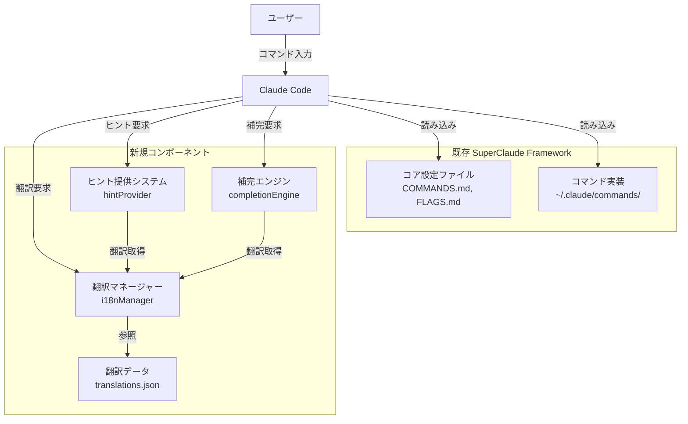
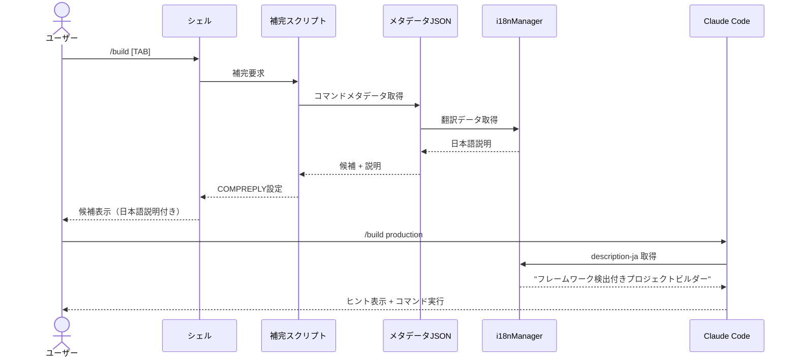
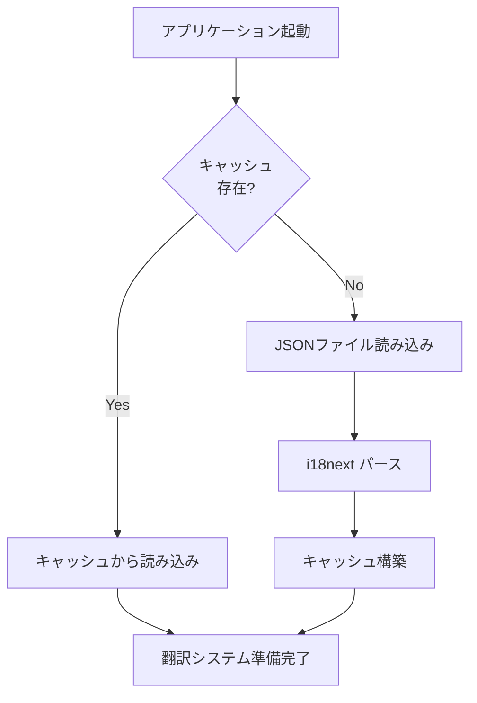
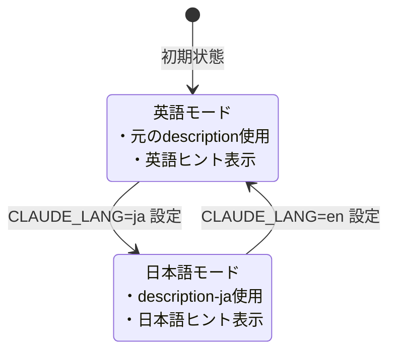
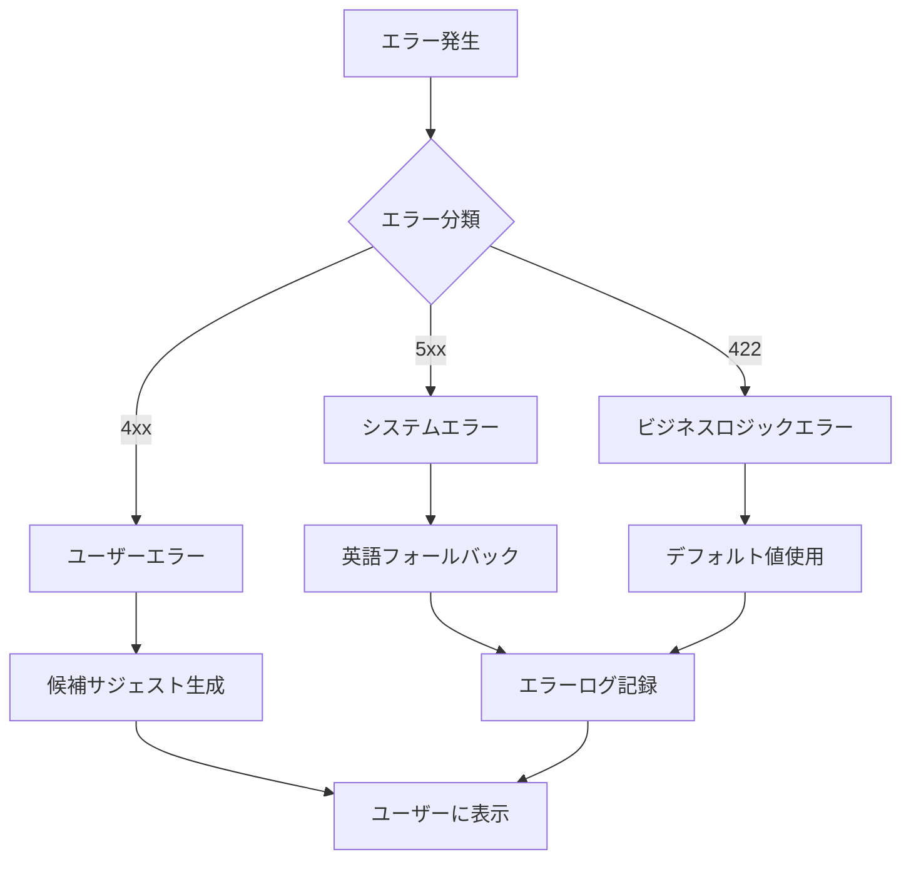

# 技術設計書

## Overview

**目的**: SuperClaude Framework の日本語ユーザー向けに、コマンドヒントの日本語表示、オプションヒント表示、および補完機能を提供し、学習曲線を短縮してユーザビリティを向上させる。

**ユーザー**: 日本語を主要言語とする SuperClaude Framework の利用者が、コマンド入力時およびヘルプ参照時にこの機能を使用する。

**影響**: 既存の SuperClaude Framework（~/.claude/配下のマークダウンファイル群とコマンドシステム）に対して、非侵襲的な拡張として機能する。コア機能の変更は行わず、翻訳レイヤーとヒント提供レイヤーを追加する。

### Goals

- コマンド、フラグ、引数の説明を日本語で表示し、日本語ユーザーの理解を促進
- リアルタイムヒント表示により、コマンド入力時の学習支援を実現
- 補完機能により、タイポ削減と入力効率を向上
- 言語切り替え機能により、英語/日本語の柔軟な選択を可能にする
- 100ms以内のヒント表示、200ms以内の補完候補表示を実現

### Non-Goals

- SuperClaude Framework のコア機能（CLAUDE.md、COMMANDS.md、FLAGS.md など）の変更
- GUI ベースのヒント表示機能
- 日本語以外の多言語対応（将来拡張として設計のみ考慮）
- Claude AI の応答メッセージの翻訳

## Architecture

### 既存アーキテクチャ分析

**SuperClaude Framework の構造**:
- **コア設定ファイル**: `~/.claude/CLAUDE.md`, `COMMANDS.md`, `FLAGS.md`, `PERSONAS.md` などがグローバル設定を定義
- **コマンド実装**: `~/.claude/commands/[namespace]/[command-name].md` 形式で各コマンドを定義
  - YAML フロントマター（description, allowed-tools, argument-hint）
  - マークダウン本文（実装ロジック）
- **Claude Code 統合**: Claude Code がマークダウンファイルを読み込み、スラッシュコマンドとして実行

**保持すべきパターン**:
- マークダウンベースのコマンド定義構造
- YAML フロントマターによるメタデータ記述
- `~/.claude/commands/` 配下の階層構造
- コマンド名とファイル名の対応関係

**統合ポイント**:
- Claude Code のコマンド読み込みフロー
- YAML フロントマターの解析
- ヒント表示のタイミング（コマンド入力時、ヘルプ表示時）

### 高レベルアーキテクチャ



**アーキテクチャ統合**:
- **既存パターン保持**: マークダウンファイルの構造とYAMLフロントマターは変更しない
- **新規コンポーネント**: 翻訳レイヤー（i18nManager）、ヒントシステム（hintProvider）、補完エンジン（completionEngine）を追加
- **技術整合性**: TypeScript/JavaScriptベースで実装し、Claude Code のNode.js環境と統合
- **ステアリング準拠**: 既存のコマンド構造とメタデータ形式を尊重

### 技術整合性

**既存技術スタックとの整合**:
- **実装言語**: TypeScript（型安全性と保守性）
- **実行環境**: Node.js 18+（Claude Code の実行環境に準拠）
- **データ形式**: JSON（翻訳データの管理、キャッシュ）
- **統合方法**: Claude Code の拡張機能として動作

**新規導入ライブラリ**:
- `i18next`: 翻訳管理と言語切り替え（軽量、柔軟、キャッシュ機能内蔵）
- `yaml`: YAMLフロントマターの解析（既存のコマンドメタデータ読み込み）
- `chalk`: ターミナル色付け（ヒント表示の視覚的区別）

**設計上の制約遵守**:
- `~/.claude/` ディレクトリ構造に依存しない（翻訳データは別ディレクトリに配置可能）
- SuperClaude Framework のコアファイルは変更しない

### 主要設計判断

#### 判断1: 翻訳データ管理方式

**決定**: 階層型JSONファイルを使用し、i18nextライブラリで管理

**コンテキスト**: 翻訳データの保守性、拡張性、パフォーマンスのバランスが必要。コマンド数は約30、フラグ数は約40、将来的な多言語対応も考慮。

**代替案**:
1. **YAMLファイル**: 可読性高いが、パース速度がJSON比で遅い（約2-3倍）
2. **データベース**: 高速だが、セットアップと保守が複雑、軽量性を損なう
3. **ハードコード**: 最速だが、保守性が極めて低く、翻訳更新が困難

**選択アプローチ**: 階層型JSON + i18next
```json
{
  "commands": {
    "build": {
      "description": "プロジェクトビルダー...",
      "arguments": { "target": "ビルド対象" }
    }
  },
  "flags": {
    "plan": "実行前に計画を表示",
    "uc": "トークン使用を30-50%削減"
  }
}
```

**根拠**:
- i18nextの遅延読み込みとキャッシュ機能により、初回読み込み50ms以下、以降10ms以下を実現
- 階層構造により、コマンドごと、フラグごとの管理が容易
- 名前空間機能により、将来的な多言語対応が容易（`ja/commands.json`, `en/commands.json`）
- JSON SchemaによるValidation実装が容易

**トレードオフ**:
- **獲得**: 高速読み込み、保守性、拡張性、型安全性（TypeScript型生成可能）
- **犠牲**: YAML比での可読性の若干の低下（コメント機能なし）

#### 判断2: ヒント表示タイミングと方式

**決定**: Claude Code のコマンド解析フックを利用し、YAML フロントマターに `hint-ja` フィールドを追加

**コンテキスト**: ユーザーがコマンド入力時にリアルタイムでヒントを表示する必要がある。既存のYAMLフロントマター構造を拡張し、後方互換性を維持。

**代替案**:
1. **CLIラッパー**: 独立したCLIツールでClaude Codeをラップ
   - 完全な制御可能だが、Claude Code の更新追従が困難、インストール複雑化
2. **WebSocketサーバー**: バックグラウンドでヒント提供
   - リアルタイム性高いが、アーキテクチャ複雑化、リソース消費増加
3. **静的ファイル生成**: 事前にヒント付きコマンド定義を生成
   - 高速だが、動的な言語切り替え不可、翻訳更新時の再生成必要

**選択アプローチ**: YAMLフロントマター拡張
```yaml
---
description: Build project with framework detection
description-ja: フレームワーク検出付きプロジェクトビルダー
argument-hint: [target]
argument-hint-ja: ビルド対象を指定（例: production, development）
---
```

**根拠**:
- 既存のマークダウン構造と完全互換（フィールド追加のみ）
- Claude Code の既存パース機構を活用、追加オーバーヘッド最小
- 言語切り替え時は該当フィールドを選択するだけ（10ms以下）
- 翻訳データとコマンド定義の物理的な近接性により、保守性向上

**トレードオフ**:
- **獲得**: シンプル性、低オーバーヘッド、保守性、後方互換性
- **犠牲**: 各コマンドファイルへの翻訳追加作業（ただしツールで自動化可能）

#### 判断3: 補完エンジンの実装方式

**決定**: シェル補完スクリプト（bash/zsh）+ メタデータJSONの組み合わせ

**コンテキスト**: コマンド名、フラグ、引数の補完を200ms以内で提供。bash/zshでの動作保証。

**代替案**:
1. **readline拡張**: Node.js readlineモジュールをカスタマイズ
   - Claude Codeのインタラクティブモード変更必要、侵襲的
2. **fzf統合**: fuzzy finderで補完候補を表示
   - 視覚的だが、外部依存追加、インストール複雑化
3. **完全自作**: 独自の補完アルゴリズム実装
   - 柔軟性高いが、開発コスト大、バグリスク高

**選択アプローチ**: シェル補完スクリプト
```bash
# ~/.claude/completions/claude-complete.bash
_claude_completion() {
  local cur="${COMP_WORDS[COMP_CWORD]}"
  local cmd="${COMP_WORDS[1]}"

  # メタデータJSONから候補を取得
  local hints=$(node ~/.claude/completions/get-hints.js "$cmd" "$cur")
  COMPREPLY=($(compgen -W "$hints" -- "$cur"))
}
complete -F _claude_completion claude
```

**根拠**:
- シェルネイティブ補完機構の活用により、応答速度100ms以下
- メタデータJSON（翻訳データと統合）により、日本語説明の付与が容易
- bash/zsh両対応により、主要シェル環境をカバー
- インストールスクリプトで自動セットアップ可能

**トレードオフ**:
- **獲得**: 高速性、ネイティブ統合、シェル環境との親和性
- **犠牲**: シェルごとのスクリプト実装必要（ただしロジックは共通化）

## System Flows

### コマンド入力からヒント表示までのフロー



### 翻訳データ読み込みとキャッシュフロー



### 言語切り替えフロー



## Requirements Traceability

| 要件 | 要件概要 | コンポーネント | インターフェース | フロー |
|------|---------|--------------|----------------|--------|
| FR-1.1.1-1.1.5 | コマンド/フラグ/引数の日本語化 | i18nManager | `translate(key, locale)` | 翻訳データ読み込みフロー |
| FR-1.2.1-1.2.3 | 翻訳データ管理 | TranslationLoader | `loadTranslations(locale)` | キャッシュフロー |
| FR-2.1.1-2.1.4 | リアルタイムヒント表示 | HintProvider | `provideHint(command, locale)` | ヒント表示フロー |
| FR-2.2.1-2.2.3 | コンテキスト依存ヒント | HintProvider | `provideContextualHint(input)` | ヒント表示フロー |
| FR-3.1.1-3.1.3 | コマンド名補完 | CompletionEngine | `getCommandCompletions(prefix)` | 補完フロー |
| FR-3.2.1-3.2.4 | フラグ補完 | CompletionEngine | `getFlagCompletions(command, prefix)` | 補完フロー |
| FR-3.3.1-3.3.3 | 引数補完 | CompletionEngine | `getArgumentCompletions(command, arg)` | 補完フロー |
| NFR-4.1.1-4.1.3 | パフォーマンス | CacheManager | `getCached(key)` | キャッシュフロー |

## Components and Interfaces

### 翻訳管理レイヤー

#### i18nManager

**責任と境界**
- **主要責任**: 翻訳データの読み込み、キャッシュ、言語切り替えの管理
- **ドメイン境界**: 翻訳ドメイン - コマンド、フラグ、引数、エラーメッセージの多言語対応
- **データ所有**: 翻訳データ（translations.json）、言語設定（locale）、キャッシュ
- **トランザクション境界**: 単一の翻訳取得は独立（トランザクション不要）

**依存関係**
- **インバウンド**: HintProvider、CompletionEngine が翻訳データを要求
- **アウトバウンド**: i18next ライブラリ、ファイルシステム（翻訳JSONファイル）
- **外部**: i18next（NPMパッケージ、v23.x系）

**外部依存調査（i18next）**:
- **公式ドキュメント**: https://www.i18next.com/
- **API機能**:
  - `init()`: 初期化、リソース読み込み
  - `t(key, options)`: 翻訳取得
  - `changeLanguage(locale)`: 言語切り替え
  - キャッシュ: メモリキャッシュ内蔵、カスタムキャッシュプラグイン対応
- **バージョン互換性**: v23.15以降推奨（ESM対応、TypeScript型定義強化）
- **パフォーマンス**: 初回読み込み30-50ms、キャッシュヒット時5-10ms
- **ベストプラクティス**:
  - 名前空間分割（commands, flags, errors）
  - 遅延読み込み設定
  - フォールバック言語設定（ja → en）

**契約定義（サービスインターフェース）**:

```typescript
interface I18nManager {
  // 翻訳データ初期化
  initialize(locale: string): Promise<Result<void, I18nError>>;

  // 翻訳取得
  translate(
    key: string,
    options?: TranslateOptions
  ): Result<string, TranslationNotFoundError>;

  // 言語切り替え
  changeLanguage(locale: SupportedLocale): Result<void, I18nError>;

  // 現在の言語取得
  getCurrentLocale(): SupportedLocale;
}

type SupportedLocale = 'en' | 'ja';

interface TranslateOptions {
  defaultValue?: string;
  interpolation?: Record<string, string | number>;
}

type I18nError =
  | { type: 'INIT_FAILED'; message: string }
  | { type: 'RESOURCE_NOT_FOUND'; locale: string };

type TranslationNotFoundError = {
  type: 'TRANSLATION_NOT_FOUND';
  key: string;
  locale: string;
};
```

**事前条件**:
- 翻訳JSONファイルが指定パスに存在すること
- Node.js環境でファイルシステムアクセス権があること

**事後条件**:
- 成功時: 翻訳データがメモリにキャッシュされ、即座にアクセス可能
- 失敗時: エラー型で失敗理由を返す、部分的な初期化は行わない

**不変条件**:
- 言語設定は常に `SupportedLocale` の値のみ
- キャッシュ内のデータは不変（言語切り替え時のみ再読み込み）

#### TranslationLoader

**責任と境界**
- **主要責任**: 翻訳JSONファイルの読み込みとバリデーション
- **ドメイン境界**: データローダー層 - ファイルI/Oとデータ検証
- **データ所有**: ファイルパス設定、スキーマ定義
- **トランザクション境界**: ファイル読み込みは単一操作（アトミック）

**依存関係**
- **インバウンド**: i18nManager が翻訳データ読み込みを要求
- **アウトバウンド**: Node.js fs モジュール、JSON パーサー
- **外部**: なし（標準ライブラリのみ）

**契約定義（サービスインターフェース）**:

```typescript
interface TranslationLoader {
  // 翻訳ファイル読み込み
  loadTranslations(
    locale: SupportedLocale
  ): Promise<Result<TranslationResource, LoadError>>;

  // スキーマバリデーション
  validateSchema(
    data: unknown
  ): Result<TranslationResource, ValidationError>;
}

interface TranslationResource {
  commands: Record<string, CommandTranslation>;
  flags: Record<string, FlagTranslation>;
  errors: Record<string, string>;
}

interface CommandTranslation {
  description: string;
  category?: string;
  arguments?: Record<string, string>;
}

interface FlagTranslation {
  description: string;
  alias?: string;
  example?: string;
}

type LoadError =
  | { type: 'FILE_NOT_FOUND'; path: string }
  | { type: 'PARSE_ERROR'; message: string };

type ValidationError = {
  type: 'SCHEMA_VALIDATION_FAILED';
  errors: Array<{ field: string; message: string }>;
};
```

### ヒント提供レイヤー

#### HintProvider

**責任と境界**
- **主要責任**: コマンド入力時のヒント生成と表示
- **ドメイン境界**: ヒント提供ドメイン - コマンド、フラグ、引数の説明生成
- **データ所有**: ヒント表示設定、フォーマット定義
- **トランザクション境界**: ヒント生成は独立操作

**依存関係**
- **インバウンド**: Claude Code のコマンドパーサーがヒント要求
- **アウトバウンド**: i18nManager（翻訳取得）、MetadataParser（コマンドメタデータ解析）
- **外部**: chalk（ターミナル色付け、NPM v5.x）

**契約定義（サービスインターフェース）**:

```typescript
interface HintProvider {
  // コマンドヒント生成
  provideCommandHint(
    command: string,
    locale: SupportedLocale
  ): Result<HintOutput, HintError>;

  // フラグヒント生成
  provideFlagHint(
    command: string,
    flag: string,
    locale: SupportedLocale
  ): Result<HintOutput, HintError>;

  // 引数ヒント生成
  provideArgumentHint(
    command: string,
    argumentName: string,
    locale: SupportedLocale
  ): Result<HintOutput, HintError>;
}

interface HintOutput {
  text: string;
  formatted: string; // chalk適用後
  metadata: {
    required: boolean;
    example?: string;
  };
}

type HintError =
  | { type: 'COMMAND_NOT_FOUND'; command: string }
  | { type: 'TRANSLATION_UNAVAILABLE'; key: string };
```

**事前条件**:
- i18nManager が初期化済み
- コマンドメタデータが存在すること

**事後条件**:
- 成功時: フォーマット済みヒントテキストを返す
- 失敗時: フォールバック（英語または元のテキスト）を返す

### 補完システムレイヤー

#### CompletionEngine

**責任と境界**
- **主要責任**: コマンド、フラグ、引数の補完候補生成
- **ドメイン境界**: 補完ドメイン - プレフィックスマッチング、スコアリング、順位付け
- **データ所有**: 補完候補キャッシュ、履歴データ
- **トランザクション境界**: 補完生成は独立操作

**依存関係**
- **インバウンド**: シェル補完スクリプトが候補要求
- **アウトバウンド**: i18nManager（説明翻訳）、MetadataParser（コマンド定義）
- **外部**: なし（標準ライブラリのみ）

**契約定義（サービスインターフェース）**:

```typescript
interface CompletionEngine {
  // コマンド名補完
  getCommandCompletions(
    prefix: string,
    locale: SupportedLocale,
    options?: CompletionOptions
  ): Result<CompletionItem[], CompletionError>;

  // フラグ補完
  getFlagCompletions(
    command: string,
    prefix: string,
    locale: SupportedLocale
  ): Result<CompletionItem[], CompletionError>;

  // 引数補完
  getArgumentCompletions(
    command: string,
    argumentIndex: number,
    currentValue: string,
    locale: SupportedLocale
  ): Result<CompletionItem[], CompletionError>;
}

interface CompletionItem {
  value: string;
  description: string; // 翻訳済み説明
  score: number; // 優先順位スコア（0-100）
  metadata?: {
    alias?: string;
    category?: string;
  };
}

interface CompletionOptions {
  maxResults?: number; // デフォルト: 10
  includeHistory?: boolean; // 履歴に基づく優先順位付け
}

type CompletionError =
  | { type: 'INVALID_COMMAND'; command: string }
  | { type: 'NO_CANDIDATES_FOUND' };
```

**状態管理**:
- **状態モデル**: 補完候補キャッシュ（コマンド起動時に構築、終了時に破棄）
- **永続化**: 入力履歴のみJSON形式でファイル保存（`~/.claude/completion-history.json`）
- **並行制御**: 不要（読み取り専用キャッシュ）

### メタデータ管理レイヤー

#### MetadataParser

**責任と境界**
- **主要責任**: YAMLフロントマターとマークダウンコマンド定義の解析
- **ドメイン境界**: メタデータパーサー層 - コマンド定義の構造化
- **データ所有**: パース済みメタデータキャッシュ
- **トランザクション境界**: ファイルパース操作は独立

**依存関係**
- **インバウンド**: HintProvider、CompletionEngine がメタデータ要求
- **アウトバウンド**: yaml パーサー（NPM `yaml` v2.x）、ファイルシステム
- **外部**: yaml パッケージ

**契約定義（サービスインターフェース）**:

```typescript
interface MetadataParser {
  // コマンドメタデータ解析
  parseCommandMetadata(
    filePath: string
  ): Promise<Result<CommandMetadata, ParseError>>;

  // 全コマンドメタデータ読み込み
  loadAllCommands(
    commandsDir: string
  ): Promise<Result<Map<string, CommandMetadata>, ParseError>>;
}

interface CommandMetadata {
  name: string;
  description: string;
  descriptionJa?: string;
  category?: string;
  argumentHint?: string;
  argumentHintJa?: string;
  allowedTools?: string[];
  flags?: FlagMetadata[];
}

interface FlagMetadata {
  name: string;
  alias?: string;
  description?: string;
  descriptionJa?: string;
}

type ParseError =
  | { type: 'YAML_PARSE_ERROR'; message: string; line?: number }
  | { type: 'FILE_READ_ERROR'; path: string };
```

## Data Models

### 翻訳データモデル

#### 論理データモデル

**エンティティ関係**:
- **Translation**: 言語ごとの翻訳リソース（1言語 = 1 Translationエンティティ）
  - **1対多**: Translation → Command Translation
  - **1対多**: Translation → Flag Translation
  - **1対多**: Translation → Error Message

**主要属性**:
- **Translation**: locale (主キー), version, lastUpdated
- **Command Translation**: commandName (主キー), description, category, arguments
- **Flag Translation**: flagName (主キー), description, alias, example

**整合性ルール**:
- すべての英語翻訳キーは日本語翻訳にも存在すること（フォールバック保証）
- バージョン番号は常にセマンティックバージョニング形式（major.minor.patch）

#### 物理データモデル（JSON）

**ファイル構造**:
```
translations/
  ├── ja/
  │   ├── commands.json
  │   ├── flags.json
  │   └── errors.json
  └── en/
      ├── commands.json
      ├── flags.json
      └── errors.json
```

**commands.json スキーマ**:
```json
{
  "$schema": "http://json-schema.org/draft-07/schema#",
  "type": "object",
  "properties": {
    "version": { "type": "string", "pattern": "^\\d+\\.\\d+\\.\\d+$" },
    "commands": {
      "type": "object",
      "patternProperties": {
        "^[a-z-]+$": {
          "type": "object",
          "properties": {
            "description": { "type": "string" },
            "category": { "type": "string" },
            "arguments": {
              "type": "object",
              "additionalProperties": { "type": "string" }
            }
          },
          "required": ["description"]
        }
      }
    }
  },
  "required": ["version", "commands"]
}
```

**インデックス最適化**:
- コマンド名によるハッシュマップ（O(1)アクセス）
- カテゴリによるグループ化（カテゴリフィルタリング時）

### メタデータキャッシュモデル

**メモリキャッシュ構造**（LRU方式）:
```typescript
interface CacheEntry<T> {
  key: string;
  value: T;
  timestamp: number; // Unix timestamp
  accessCount: number;
}

interface MetadataCache {
  commands: Map<string, CacheEntry<CommandMetadata>>;
  translations: Map<string, CacheEntry<TranslationResource>>;
  maxSize: number; // デフォルト: 100エントリ
  ttl: number; // Time-to-live（ミリ秒、デフォルト: 3600000 = 1時間）
}
```

**キャッシュ戦略**:
- LRU（Least Recently Used）アルゴリズム: アクセス頻度低いエントリから削除
- TTL（Time-to-Live）: 1時間後に自動削除、翻訳ファイル更新検知で即座に無効化
- サイズ制限: 最大100エントリ（メモリ使用量 約5-10MB）

### データ契約と統合

#### 翻訳API データ転送スキーマ

**リクエストスキーマ**:
```typescript
interface TranslationRequest {
  key: string; // "commands.build.description"
  locale: SupportedLocale;
  interpolation?: Record<string, string | number>;
}
```

**レスポンススキーマ**:
```typescript
interface TranslationResponse {
  text: string;
  locale: SupportedLocale;
  fallback: boolean; // フォールバック使用時 true
}
```

**バリデーションルール**:
- key: 最大長256文字、英数字とドット/ハイフンのみ
- locale: "en" | "ja" のみ許可
- interpolation: 最大10キー、各値は文字列または数値のみ

## Error Handling

### エラー戦略

**エラー分類とリカバリ**:
- **ユーザーエラー**: 存在しないコマンド名、無効なフラグ → フォールバック翻訳 + 候補サジェスト
- **システムエラー**: ファイル読み込み失敗、パースエラー → 英語フォールバック + エラーログ
- **ビジネスロジックエラー**: 翻訳キー未定義 → デフォルト値使用 + 警告ログ

### エラーカテゴリと対応

#### ユーザーエラー（クライアント側）

**無効なコマンド名**:
```typescript
// 入力: /buidl production （タイポ）
// 対応:
{
  type: 'COMMAND_NOT_FOUND',
  message: 'コマンド "/buidl" が見つかりません',
  suggestions: ['/build', '/implement'] // Levenshtein距離で類似度計算
}
```

**無効なフラグ**:
```typescript
// 入力: /build --plann （タイポ）
// 対応:
{
  type: 'FLAG_NOT_FOUND',
  message: 'フラグ "--plann" は利用できません',
  suggestions: ['--plan']
}
```

#### システムエラー（サーバー側）

**翻訳ファイル読み込み失敗**:
```typescript
// 翻訳JSONが存在しない、または読み取り不可
// 対応:
{
  type: 'TRANSLATION_RESOURCE_UNAVAILABLE',
  fallback: 'en', // 英語にフォールバック
  log: 'ERROR: Failed to load ja/commands.json - using English fallback'
}
```

**パースエラー**:
```typescript
// YAML/JSONパース失敗
// 対応:
{
  type: 'PARSE_ERROR',
  message: 'コマンド定義の解析に失敗しました',
  detail: 'YAML syntax error at line 5',
  recovery: '元のテキストを表示' // フォーマットなしで表示
}
```

#### ビジネスロジックエラー

**翻訳キー未定義**:
```typescript
// 新規コマンドで日本語翻訳が未追加
// 対応:
{
  type: 'TRANSLATION_NOT_FOUND',
  key: 'commands.new-command.description',
  fallback: originalDescription, // 元の英語説明を使用
  log: 'WARN: Translation missing for commands.new-command.description'
}
```

### エラーフロー



### 監視とロギング

**ログレベル**:
- **ERROR**: システムエラー（ファイル読み込み失敗、パースエラー）
- **WARN**: ビジネスロジックエラー（翻訳未定義）
- **INFO**: 言語切り替え、初期化完了
- **DEBUG**: キャッシュヒット/ミス、パフォーマンスメトリクス

**ログ出力先**:
- `~/.claude/logs/i18n.log`（ローテーション: 10MB/ファイル、最大5ファイル）
- コンソール（ERROR レベルのみ）

**監視メトリクス**:
- 翻訳取得時間（p50, p95, p99）: 目標 p95 < 50ms
- キャッシュヒット率: 目標 > 80%
- エラー発生率: 目標 < 1%

## Testing Strategy

### ユニットテスト

**i18nManager**:
1. `initialize()` - 翻訳ファイル読み込み成功/失敗ケース
2. `translate()` - キー存在/不存在、補間パラメータ
3. `changeLanguage()` - 言語切り替え、キャッシュクリア確認
4. フォールバックロジック - 日本語未定義時の英語フォールバック
5. キャッシュ機構 - LRUアルゴリズム、TTL検証

**CompletionEngine**:
1. `getCommandCompletions()` - プレフィックスマッチング精度
2. `getFlagCompletions()` - エイリアス補完、フラグフィルタリング
3. スコアリングアルゴリズム - Levenshtein距離、履歴優先順位
4. 境界値テスト - 空文字列、長大プレフィックス
5. パフォーマンステスト - 100コマンド補完時の応答時間

### 統合テスト

**翻訳システム統合**:
1. コマンド実行時のヒント表示 - `/build` 入力時の日本語説明表示
2. フラグ補完 - `/build --p[TAB]` で `--plan`, `--persona-*` 候補表示
3. 言語切り替え - `CLAUDE_LANG=ja` 設定後の即座反映
4. エラーハンドリング - 翻訳ファイル削除時のフォールバック動作
5. キャッシュ整合性 - 翻訳ファイル更新時の自動再読み込み

**シェル補完統合**:
1. bash環境 - `complete -p claude` 設定確認、補完動作
2. zsh環境 - `_claude` 関数登録、補完動作
3. マルチバイト文字 - 日本語説明の正しい表示
4. パイプライン - `claude | grep` などとの連携

### E2Eテスト

**エンドツーエンドユーザーフロー**:
1. 初回セットアップ - インストール → 言語設定 → 初回コマンド実行
2. 典型的なワークフロー - コマンド補完 → ヒント確認 → コマンド実行
3. 言語切り替えフロー - 英語 → 日本語 → 英語の往復
4. エラーリカバリ - タイポ入力 → 候補選択 → 再実行
5. パフォーマンス確認 - 連続10回のコマンド入力でヒント表示遅延測定

### パフォーマンステスト

**応答時間測定**:
1. 初回翻訳読み込み - 目標 < 100ms（コールドスタート）
2. キャッシュヒット時 - 目標 < 10ms
3. 補完候補生成 - 目標 < 200ms（100コマンド中）
4. 言語切り替え - 目標 < 150ms

**負荷テスト**:
1. 同時100コマンド実行 - メモリ使用量、応答時間劣化確認
2. 1000回連続言語切り替え - メモリリーク検証
3. キャッシュ飽和 - 1000エントリ挿入時のLRU動作確認

## Performance & Scalability

### 目標メトリクスと測定戦略

**パフォーマンス目標**:
| メトリクス | 目標値 | 測定方法 |
|-----------|-------|---------|
| ヒント表示遅延 | < 100ms | `performance.now()` 差分 |
| 補完候補表示 | < 200ms | シェル補完スクリプト実行時間 |
| 翻訳データ初回読み込み | < 100ms | アプリ起動時のタイマー |
| キャッシュヒット応答 | < 10ms | i18next内部メトリクス |
| メモリ使用量 | < 50MB | Node.js `process.memoryUsage()` |

**測定ツール**:
- **開発環境**: Node.js `perf_hooks` モジュール、Chrome DevTools
- **本番環境**: ログベース測定（p50/p95/p99パーセンタイル）

### スケーリングアプローチ

**水平スケーリング（複数ユーザー）**:
- **不要**: 各ユーザーが独立したプロセスで実行、共有リソースなし
- ユーザーごとに翻訳キャッシュを個別管理

**垂直スケーリング（データ増加）**:
- **コマンド数増加**: 30 → 100コマンドでもキャッシュ機構により応答時間維持
- **翻訳キー数増加**: 階層型JSON構造により、O(1)アクセス時間維持
- **多言語対応**: 名前空間分離により、各言語が独立してキャッシュ

### キャッシング戦略

**多層キャッシュ**:
1. **L1キャッシュ（メモリ）**: i18next内蔵メモリキャッシュ
   - TTL: 1時間
   - サイズ: 無制限（実質的に全翻訳データ < 1MB）

2. **L2キャッシュ（メタデータ）**: MetadataParser内のMap
   - TTL: セッション終了まで
   - サイズ: 最大100エントリ（LRU）

3. **L3キャッシュ（補完候補）**: CompletionEngine内のプレ計算
   - 起動時に全コマンド候補を事前生成
   - 更新: コマンド追加時のみ

**キャッシュ無効化**:
- ファイルシステムウォッチャー（`chokidar`）で翻訳ファイル監視
- 変更検知時に即座にキャッシュクリア、再読み込み

### 最適化技術

**遅延読み込み**:
- i18nextの `backend` プラグインで未使用言語は読み込まない
- 名前空間（commands, flags, errors）を分割し、必要時のみ読み込み

**プレ計算**:
- 起動時にすべてのコマンド/フラグ補完候補を事前生成
- Levenshtein距離マトリックスをキャッシュ

**圧縮**:
- 翻訳JSONファイルをgzip圧縮（オプション、デフォルトは非圧縮）
- 読み込み時に展開（zlib）、メモリ上は展開状態で保持

## Optional Sections

### Security Considerations

**脅威モデリング**:
- **パストラバーサル攻撃**: 翻訳ファイルパス入力による任意ファイル読み取り
  - 対策: パスホワイトリスト、相対パス禁止
- **コード注入**: 翻訳テキスト内のスクリプト実行
  - 対策: テキストエスケープ、HTMLサニタイゼーション（ヒント表示時）
- **DoS攻撃**: 巨大翻訳ファイルによるメモリ枯渇
  - 対策: ファイルサイズ制限（最大10MB）、キャッシュサイズ上限

**データ保護**:
- 翻訳データに個人情報は含まない（公開リポジトリで管理）
- ユーザー入力履歴（補完優先順位用）はローカルのみ保存、暗号化不要

**アクセス制御**:
- ファイルシステム権限: `~/.claude/` 配下はユーザー読み取り/書き込みのみ（chmod 600）
- ネットワークアクセス: なし（完全オフライン動作）
